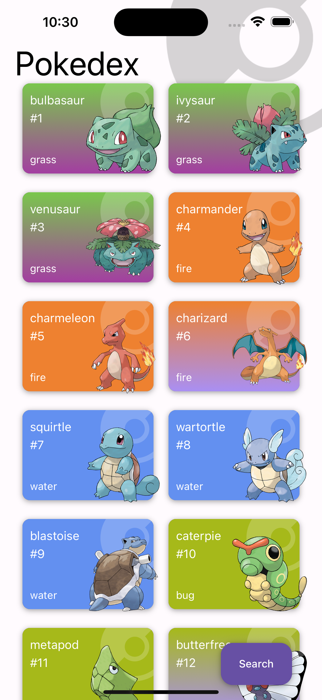
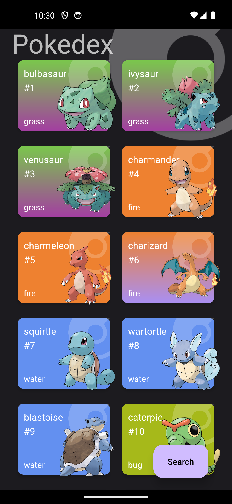

# Componets app 
Pokedex App in React Native with light and dark mode, call apis, cache, navigation, debounce and search.

## How to run 
- Clone/download the repo.
- Install the dependencies with `npm install`.
- Run the project with Android `npm start`.
- Run the project with iOS `npm run start:ios`.

## Screenshots

<table>
   <tr>
      <td>  </td>
      <td>  </td>
      <td>  </td>
   </tr>

   <tr>
      <td>  </td>
      <td>  </td>
      <td>  </td>
   </tr>
</table>

